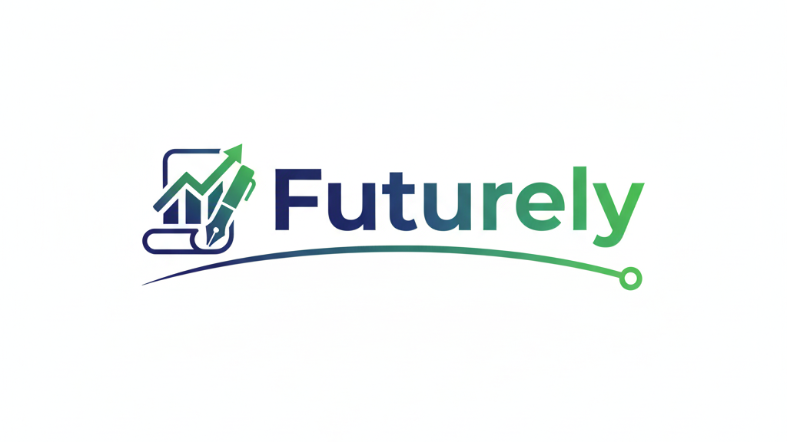

# 🚀 Futurely

**Futurely** is an AI-powered career platform that helps students and professionals generate resumes, CV/cover letters, prepare for interviews, and discover recommended courses — all from one smart dashboard.

---

## ✨ Features

- 📄 **Resume Generator** – Create ATS-friendly resumes  
- ✉️ **CV / Cover Letter Generator** – Personalized letters for different roles  
- 🎯 **Interview Preparation**
  - Common interview questions  
  - Role-based preparation guides  
  - Smart interview tips  
- 📚 **Recommended Courses** – AI-suggested learning paths  
- ⚡ **Fast & Clean UI** – Responsive and performance-optimized  

---



## 🛠️ Tech Stack

- **Next.js**
- **Neon DB (PostgreSQL)**
- **Prisma ORM**
- **Tailwind CSS**
- **Shadcn UI**
- **Inngest**

---

## 📂 Project Structure

```
futurely/
├── app/            # App router pages & layouts
├── components/     # Reusable UI components
├── lib/            # Utilities & Prisma client
├── prisma/         # Database schema
├── public/         # Static assets
└── README.md
```

---

## ⚙️ Setup & Installation

1. Clone the repository
```bash
git clone https://github.com/shravaniraut175/futurely.git
```

2. Install dependencies
```bash
npm install
```

3. Configure environment variables  
Create a `.env` file:
```env
DATABASE_URL=
```

4. Setup Prisma
```bash
npx prisma generate
npx prisma migrate dev
```

5. Run the development server
```bash
npm run dev
```

---

## 🚀 Why Futurely?

- Solves real-world career problems  
- Built with a modern full-stack setup  
- Demonstrates scalable architecture  
- Ideal for portfolios, hackathons & internships  

---

## 🔮 Future Improvements

- Resume scoring & ATS analysis  
- AI-powered mock interviews  
- PWA / mobile support  
- Career roadmap generation  

---

## 📜 License

This project is licensed under the **MIT License**.

